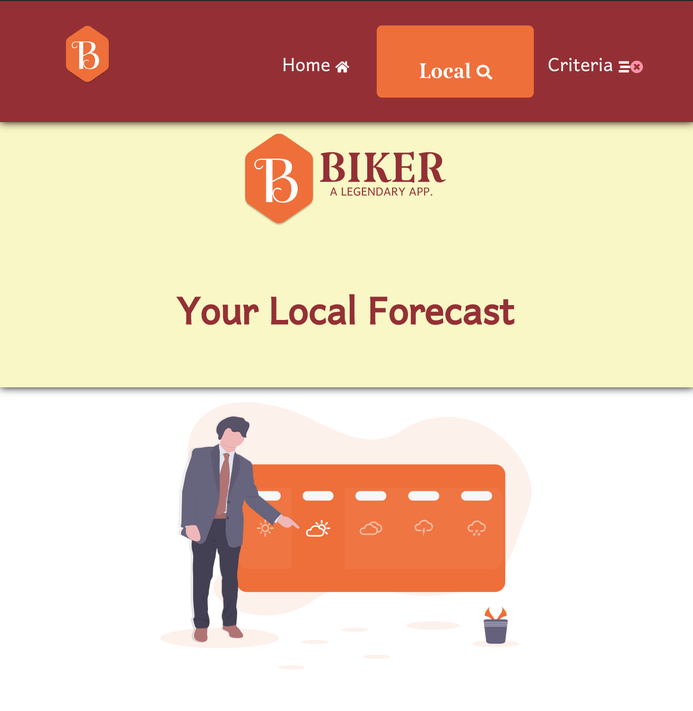
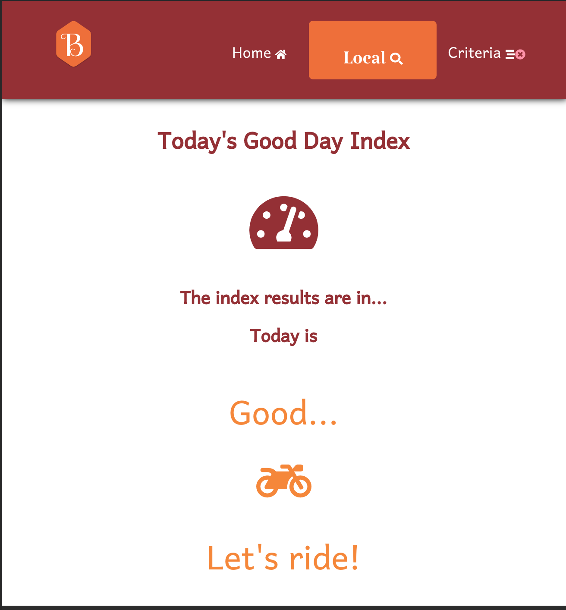
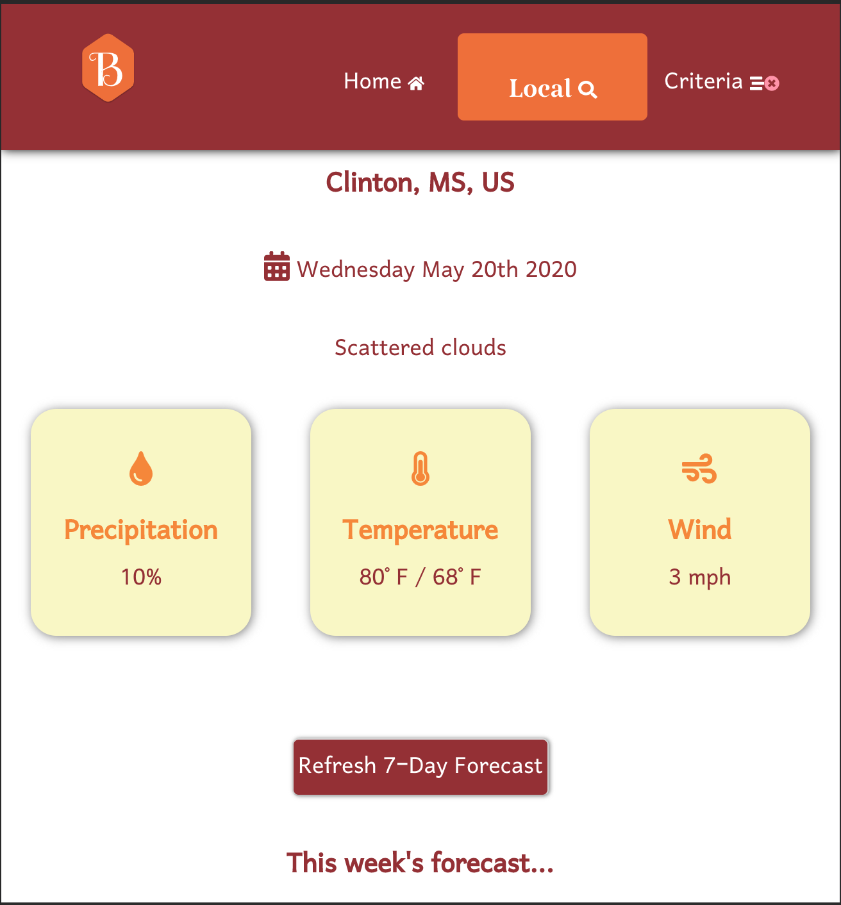
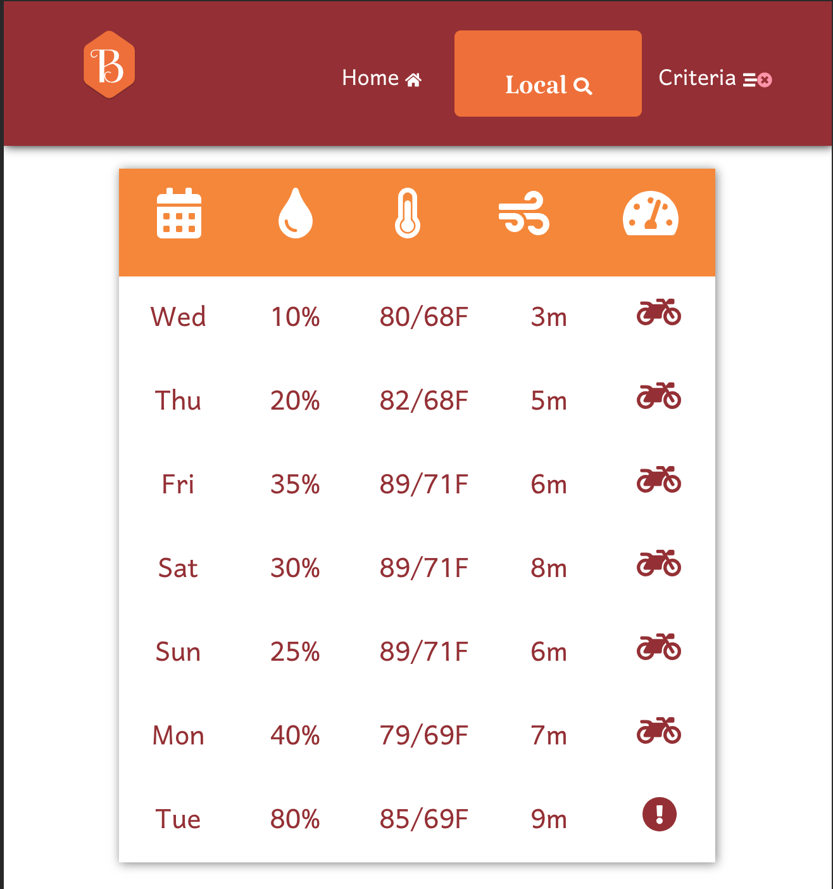

# Programming Interview Exercise 

The following project is a Biker's Weather App built during Mid-April to Mid-May 2020. The user accesses the site, then may find out if today and this week are good days for the biker to go for a ride. 

See the issues for a list of features that are under construction.

## Screenshots

### _Landing Page_

*Mobile Landing*

### _Local Forecast Page_

## Installation

Node JS and npm must be installed prior to the next commands

### `npm install`

Install will pull in all required dependencies.

Next you must create your own copy of .env with the following code and insert your own API_KEY.

The queries should each return back 'OK'.

### `source .env`

Run this command, so app.js will connect correctly to your username and password variables.

### `npm run dev`

Runs the app in the development mode. 
Open [http://localhost:3000](http://localhost:3000) to view it in the browser.

### `npm start`

In another terminal instance run this comman. 
Runs the app in the development mode. 
Open [http://localhost:3000](http://localhost:3000) to view it in the browser.

The page will reload if you make edits. 
You will also see any lint errors in the console.

## Technologies Used

### Languages and Frameworks
    * HTML5
    * CSS3
    * JS
    * React JS
    * Node JS
   
### API

  
[WeatherBit.io](https://www.weatherbit.io/) 

### Thanks

Please offer report any feedback to me via Pull Request @leviking.

Thanks for reading thus far!

This project was bootstrapped with [Create React App](https://github.com/facebook/create-react-app).
